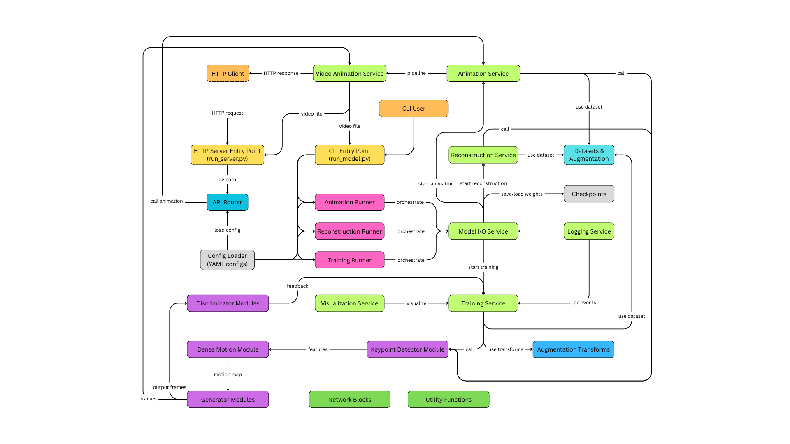

# Animatica-ml-engine
Animatica is my diploma project that generates image animation from videos in real time or not using neural networks (FOMM).
It automates animation creation with image generation, image-to-video conversion, and post-processing.

## Deploying on Local

### Setting up the environment

#### Step 1: Create a virtual environment

###### *Linux/macOS:*

```bash
python3 -m venv venv
source venv/bin/activate
```

###### *Windows:*

```bash
python -m venv venv
source venv/Scripts/activate
```

#### Step 2: Install requirements

```bash
cd app
pip install -r requirements.txt
```

#### Step 3: Create env files

```bash
# env/ml_engine.env
ML_ENGINE_KEY=your-secret-key
API_MODE=local
LOG_LEVEL=debug
```

#### Step 4: Preparing models

Download pretrained models and save them in folder named __/app/data/checkpoints/__.

Checkpoints can be found under following link: 
[google-drive](https://drive.google.com/drive/folders/1PyQJmkdCsAkOYwUyaj_l-l0as-iLDgeH)
 or [yandex-disk](https://disk.yandex.ru/d/lEw8uRm140L_eQ).

###### *Linux/macOS:*

```bash
unzip checkpoints.zip
rm checkpoints.zip
```

###### *Windows:*

Unzip __checkpoints.zip__ using unzipping software like __7zip__.


### Test ML Model

#### Step 1: Change directory

Go to **app/src** directory:

```bash
cd app/src
```

#### Step 2: Use cases

1. Run the project from __Jupyter Notebook__ named __test.ipynb__.
2. Run the project using __CLI__ (Command Line Interface).

    __Examples:__

   ```bash
   python run_model.py --mode train --configs config.yaml
   ```
   ```bash
   python run_model.py --mode reconstruction --configs config.yaml --checkpoint path/to/ckpt
   ```
   ```bash
   python run_model.py --mode animate --configs config.yaml --checkpoint path/to/ckpt
   ```

### Test Server

#### Step 1: Change directory

Go to **app** directory:

```bash
cd app
```

#### Step 2: Run server

```bash
uvicorn src.run_server:app --host 0.0.0.0 --port 90 --reload 
```

#### Step 3: Use cases

Available endpoints:
- http://localhost:90/docs (Swagger docs).
- http://localhost:90/api/fomm/video (Image animation).

## Deploying via Docker

### Docker container

#### Step 1: Change directory

Go to **app** directory:

```bash
cd app
```

#### Step 2: Build Image

```bash
docker build . --tag animatica-ml-engine
```

#### Step 3: Run container

```bash
docker run --name ml-engine -p 9080:90 animatica-ml-engine 
```

After, you can use the following endpoints:
- http://localhost:9080/docs (Swagger docs).
- http://localhost:9080/api/fomm/video (Image animation).

### Docker-compose

You can use __Docker-compose__ with [Animatica-backend](https://github.com/kefirchk/Animatica-backend).

My ready-made image:
[kefirchk/animatica-ml-engine:latest](https://hub.docker.com/r/kefirchk/animatica-ml-engine)

## System Design




## Demo

<div style="text-align: center;">

 \
_Real Time Demo_
</div>

---

<div style="text-align: center;">
    
 \
_Source Image_
</div>

---

<div style="text-align: center;">

 \
_Driving Video_
</div>

---

<div style="text-align: center;">
    
 \
_Animated Image (result)_
</div>

---

## TODO
- [x] Add pre-commit.
- [x] Add Docker.
- [ ] Add GitHub Actions.
- [ ] Optimize ML Model for CPU using.
- [ ] Update the project with async operations.
